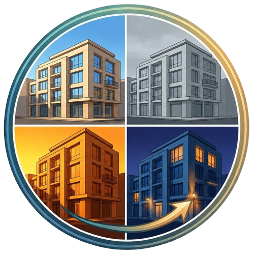
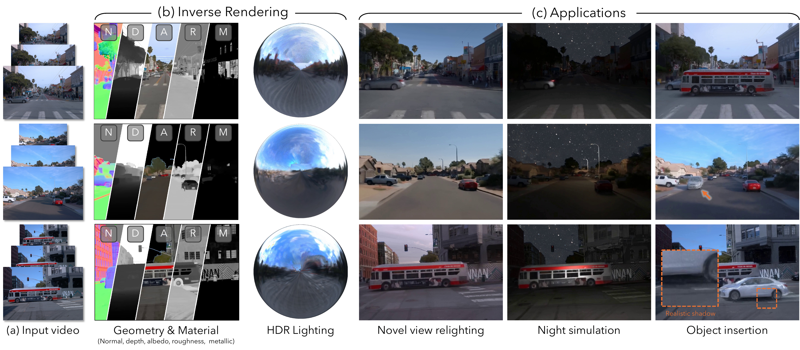

<div align="center">
  <h1>&nbsp;BRDFusion: Physics Meets Generation for Urban Scene Inverse Rendering</h1>

  <p>
    <a href="https://shigon255.github.io/"><strong>Yi-Ruei Liu</strong></a> ·
    <a href="https://jayinnn.dev/"><strong>Jie-Ying Lee</strong></a> ·
    <a href="https://brian90709.github.io/"><strong>Zheng-Hui Huang</strong></a> ·
    <a href="https://yulunalexliu.github.io/"><strong>Yu-Lun Liu</strong></a> ·
    <a href="https://chih-hao-lin.github.io/"><strong>Chih-Hao Lin</strong></a>
  </p>

  <h3>
    <a href="https://shigon255.github.io/brdfusion-page/">🌐 Project Page</a> |
    <a href="#">📄 arXiv</a> |
    <a href="https://huggingface.co/datasets/Shigon/BRDFusion_data">🤗 Dataset</a> |
    <a href="https://huggingface.co/Shigon/BRDFusion_checkpoints">🤗 Pretrained Checkpoints</a> |
    <a href="https://huggingface.co/datasets/Shigon/BRDFusion_videos">🤗 Eval Results</a>
  </h3>
</div>

<div align="center">
  
</div>

BRDFusion combines physics-based inverse rendering with generative modeling for high-quality urban scene relighting. It decomposes urban videos into geometry, materials, and HDR lighting for novel-view rendering, relighting, and scene-edit applications.


<!-- <a id="news"></a>
## 📰 News

- 2026/6/7: Code Release. -->

<!-- 
<a id="what-you-can-do"></a>
## ✨ What You Can Do

| Workflow | Entry point |
| --- | --- |
| Render pretrained checkpoints | `tools/run_pipeline.py --stage render` |
| Run Gen. Render refinement | `tools/run_pipeline.py --stage gen_render` |
| Compute metrics | `tools/run_pipeline.py --stage compute_metrics` or precomputed videos |
| Train BRDFusion | `tools/run_pipeline.py` |
| Run relighting and scene-edit applications | `scripts/applications/render.sh` | -->

<a id="table-of-contents"></a>
## 📋 Table of Contents
- [🚀 Quick Start](#quick-start)
  - [🔦 Prerequisites](#prerequisites)
  - [⚙️ Installation](#installation)
  - [📦 Download Data](#download-data)
  - [🧩 Download Pretrained Checkpoints](#download-pretrained-checkpoints)
  - [🖼️ Render from a Checkpoint](#render-from-a-checkpoint)
  - [✨ Gen. Render](#gen-render)
  - [📊 Metric Computation](#metric-computation)
  - [🎬 Applications](#applications)
- [🏋️ Training](#training)
- [🛣️ Additional Waymo Scenes Processing](#additional-waymo-scenes-processing)

<a id="quick-start"></a>
## 🚀 Quick Start

Use the provided preprocessed datasets and pretrained checkpoints for direct inference and evaluation. Training is covered in [Training](#training), and optional Waymo preprocessing is covered in [Additional Waymo Scenes Processing](#additional-waymo-scenes-processing).

<a id="prerequisites"></a>
### 🔦 Prerequisites

The codebase has been tested on:

- **OS**: Ubuntu 22.04
- **GPU**: NVIDIA RTX A6000
- **C compiler**: `gcc` and `g++` version 11. We assume that the system provides the aliases `gcc-11` and `g++-11`.
- **Memory note**: An RTX 4090 can also run some stages when memory usage allows, but the Gen. Render stage can exceed the 24 GB memory limit.

<a id="installation"></a>
### ⚙️ Installation

BRDFusion uses two environments for the main workflows:

| Environment | Used for | CUDA |
| --- | --- | --- |
| `brdfusion` | checkpoint staging, PBR rendering, applications, and metrics | 11.8 |
| `cosmos-predict1` | DiffusionRenderer Gen. Render refinement | 12.1 |

Note that we install CUDA 11.8 in the `brdfusion` env, while using CUDA 12.1 in the system for `cosmos-predict1`. If your system don't have CUDA 12.1 installed, install it in `cosmos-predict1` as well.

Clone the repository:

```bash
git clone --recursive https://github.com/shigon255/BRDFusion.git
cd BRDFusion
```

<details>
<summary>Install the main <code>brdfusion</code> environment</summary>

```bash
conda create -n brdfusion python=3.11
conda activate brdfusion

cd third_party/3dgrut
conda install -y cuda-toolkit cmake ninja -c nvidia/label/cuda-11.8.0
conda install -y pytorch==2.1.2 torchvision==0.16.2 torchaudio==2.1.2 pytorch-cuda=11.8 "numpy<2.0" "mkl=2023.2.0" -c pytorch -c nvidia/label/cuda-11.8.0 -c conda-forge
CC=gcc-11 CXX=g++-11 pip install --find-links https://nvidia-kaolin.s3.us-east-2.amazonaws.com/torch-2.1.2_cu118.html kaolin==0.17.0
conda install -c conda-forge mesa-libgl-devel-cos7-x86_64 -y
pip install setuptools==71.1.0

git submodule update --init --recursive
CC=gcc-11 CXX=g++-11 python -m pip install --no-build-isolation -r requirements.txt
CC=gcc-11 CXX=g++-11 pip install -e .

cd ../../
CC=gcc-11 CXX=g++-11 pip install --no-build-isolation -r requirements.txt
CC=gcc-11 CXX=g++-11 python -m pip install --no-build-isolation git+https://github.com/nerfstudio-project/gsplat.git@v1.3.0
CC=gcc-11 CXX=g++-11 pip install --no-build-isolation git+https://github.com/facebookresearch/pytorch3d.git
CC=gcc-11 CXX=g++-11 pip install --no-build-isolation git+https://github.com/NVlabs/nvdiffrast
cd third_party/smplx
pip install -e .
cd ../..
pip install numpy==1.26.4
conda deactivate
```

</details>

<details>
<summary>Install the DiffusionRenderer <code>cosmos-predict1</code> environment and download the weights </summary>

```bash
cd third_party/cosmos1-diffusion-renderer
conda env create --file cosmos-predict1.yaml
conda activate cosmos-predict1
pip install -r requirements.txt

ln -sf $CONDA_PREFIX/lib/python3.10/site-packages/nvidia/*/include/* $CONDA_PREFIX/include/
ln -sf $CONDA_PREFIX/lib/python3.10/site-packages/nvidia/*/include/* $CONDA_PREFIX/include/python3.10
pip install transformer-engine[pytorch]==1.12.0

ln -sf $CONDA_PREFIX/lib/python3.10/site-packages/triton/backends/nvidia/include/crt $CONDA_PREFIX/include/
CC=gcc-11 CXX=g++-11 pip install --no-build-isolation git+https://github.com/NVlabs/nvdiffrast.git
```
For non-Ubuntu platforms, check the [nvdiffrast documentation](https://nvlabs.github.io/nvdiffrast/) and [Dockerfile](https://github.com/NVlabs/nvdiffrast/blob/main/docker/Dockerfile).

After installing `cosmos-predict1`, download the DiffusionRenderer weights from [Hugging Face](https://huggingface.co/collections/zianw/cosmos-transfer1-diffusionrenderer-6849f2a4da267e55409b8125). Generate a Hugging Face access token, run `hf auth login`, and place the weights under `third_party/cosmos1-diffusion-renderer/checkpoints`:

```bash
CUDA_HOME=$CONDA_PREFIX PYTHONPATH=$(pwd) \
  python scripts/download_diffusion_renderer_checkpoints.py --checkpoint_dir checkpoints
cd ../..
conda deactivate
```
</details>


Prepare SMPL assets:

1. Download SMPL v1.1 (`SMPL_python_v.1.1.0.zip`) from the [SMPL official website](https://smpl.is.tue.mpg.de/download.php).
2. Move `SMPL_python_v.1.1.0/smpl/models/basicmodel_neutral_lbs_10_207_0_v1.1.0.pkl` to `smpl_models/SMPL_NEUTRAL.pkl`.

<a id="download-data"></a>
### 📦 Download Data

We provide preprocessed evaluation data for selected Waymo Open Dataset scenes and all synthetic dataset scenes.

The synthetic dataset capture the urban scene in Blender using 3 cameras. We render 6 paths in the scene. Each path includes 100 ground-truth RGB, material, and relighting RGB frames. For each path we render a shifted version (`path*-3-calib_*`) of it used for the reported NVS, inverse rendering, and NVS-relight metrics. Note that we use 1 camera and the first 51 frames for evaluation. The synthetic 3D assets come from [BlenderKit](https://www.blenderkit.com/), and the HDRIs come from [PolyHaven](https://polyhaven.com/hdris).

Download the preprocessed datasets from [huggingface](https://huggingface.co/datasets/Shigon/BRDFusion_data), unzip them under the repository root, and keep this top-level layout. Note that training, rendering, and computation for each scene only require the data for that specific scene. Since the full dataset is quite large, you can download only the subset of scenes you want to try.

```text
data/
  self/
    path{1..6}_fixed_tree_gamma_full/
    path{1..6}-3-calib_fixed_tree_gamma_full/
  waymo/processed/training/{003,019,114,172,703}/
```

<details>
<summary>Detailed dataset layout</summary>
Frame files use the `<frame>_<camera>` naming convention, for example `000_0.png` for synthetic images and `000_0.jpg` for Waymo images and DiffusionRenderer priors.

Synthetic original paths contain RGB frames, camera calibration, ground-truth intrinsics, DiffusionRenderer priors, and DiffusionLight lighting priors:

```text
data/self/path1_fixed_tree_gamma_full/qwantani_moon_noon_puresky_4k/
  Camera_Center_poses.txt
  Cam_Left_poses.txt
  Cam_Right_poses.txt
  images/
  intrinsics/
  sky_masks/
  gt_sky_mask/
  depth/
  normal/
  albedo/
  roughness/
  metallic/
  diffusion_renderer_depth/
  diffusion_renderer_normal/
  diffusion_renderer_albedo/
  diffusion_renderer_roughness/
  diffusion_renderer_metallic/
  dlenvmap/
  qwantani_moon_noon_puresky_4k.exr
```

Synthetic relighting scenes provide target RGB frames and the target environment map:

```text
data/self/path1_fixed_tree_gamma_full/qwantani_moon_noon_puresky_4k_rot90/
  Camera_Center_poses.txt
  Cam_Left_poses.txt
  Cam_Right_poses.txt
  images/
  intrinsics/
  qwantani_moon_noon_puresky_4k_rot90.exr
  qwantani_moon_noon_puresky_4k_rot90.hdr
```

Shifted-path synthetic scenes are used for the reported shifted-path metrics:

```text
data/self/path1-3-calib_fixed_tree_gamma_full/qwantani_moon_noon_puresky_4k/
  Camera_Center_poses.txt
  Cam_Left_poses.txt
  Cam_Right_poses.txt
  images/
  intrinsics/
  gt_sky_mask/
  depth/
  normal/
  albedo/
  roughness/
  metallic/
  colmap_1cam/
  qwantani_moon_noon_puresky_4k.exr
```

Waymo scenes contain preprocessed data plus the priors needed by BRDFusion training:

```text
data/waymo/processed/training/003/
  images/
  lidar/
  ego_pose/
  extrinsics/
  intrinsics/
  sky_masks/
  dynamic_masks/
  instances/
  diffusion_renderer_depth/
  diffusion_renderer_normal/
  diffusion_renderer_albedo/
  diffusion_renderer_roughness/
  diffusion_renderer_metallic/
  dlenvmap/
```

</details>

For additional Waymo scenes, see [Additional Waymo Scenes Processing](#additional-waymo-scenes-processing).

<a id="download-pretrained-checkpoints"></a>
### 🧩 Download Pretrained Checkpoints

We provide 1-camera checkpoints trained on frames `0..50` with `test_image_stride=10`. Download the checkpoints from [huggingface](https://huggingface.co/Shigon/BRDFusion_checkpoints) and unzip them under `ckpt/`:

```text
ckpt/
  self/path{1..6}_fixed_tree_gamma_full/qwantani_moon_noon_puresky_4k/checkpoint_final.pth
  waymo/{003,019,114,172,703}/checkpoint_final.pth
```

Stage the downloaded checkpoints into the run-folder layout used by the rendering tools:

```bash
bash scripts/stage_ckpt.sh
```

The staging script places checkpoints under the corresponding `work_dirs/` run directories for `tools/run_pipeline.py` and `scripts/applications/render.sh`.


<a id="render-from-a-checkpoint"></a>
### 🖼️ Render from a Checkpoint

After staging checkpoints, PBR-render through `tools/run_pipeline.py`. The common targets are:

| Dataset | Typical target | Command selector |
| --- | --- | --- |
| Waymo | reconstructed lighting | `--dataset waymo --scene_idx <id> --render_target recon` |
| Synthetic | recon, relight, shifted recon, shifted relight | `--dataset self --path_id <id> --render_target all` |

Waymo example:

```bash
python tools/run_pipeline.py \
  --dataset waymo \
  --cams 1 \
  --scene_idx 3 \
  --stage render \
  --render_target recon
```

Synthetic dataset example:

```bash
python tools/run_pipeline.py \
  --dataset self \
  --cams 1 \
  --path_id 1 \
  --stage render \
  --render_target all \
  --relight_scene_idx qwantani_moon_noon_puresky_4k_rot90
```

<details>
<summary>Render target details</summary>

- `recon`: original path under reconstructed lighting.
- `relight`: original path under a target environment map.
- `shifted_recon`: shifted synthetic path under reconstructed lighting.
- `shifted_relight`: shifted synthetic path under target lighting.

Waymo relighting requires `--relight_envmap_path` because Waymo does not include ground-truth relight scenes. Synthetic relighting defaults to `<scene_idx>_rot90` unless you pass `--relight_scene_idx`.

</details>

<a id="gen-render"></a>
### ✨ Gen. Render

Gen. Render runs DiffusionRenderer forward refinement on videos produced by the render stage. Use the same dataset, scene/path, camera setting, frame range, and render targets as the render command.

Waymo:

```bash
python tools/run_pipeline.py \
  --dataset waymo \
  --cams 1 \
  --scene_idx 3 \
  --stage gen_render \
  --render_target recon
```

Synthetic dataset:

```bash
python tools/run_pipeline.py \
  --dataset self \
  --cams 1 \
  --path_id 1 \
  --stage gen_render \
  --render_target all
```

Gen. Render outputs are written next to the rendered videos for the selected target.

<a id="metric-computation"></a>
### 📊 Metric Computation

Metric computation assumes Gen. Render has completed for the selected targets. Waymo computes NVS image metrics. Synthetic dataset scenes compute NVS, relighting, and intrinsic metrics on both original and shifted paths.

Waymo:

```bash
python tools/run_pipeline.py \
  --dataset waymo \
  --cams 1 \
  --scene_idx 3 \
  --stage compute_metrics \
  --render_target recon
```

Synthetic dataset:

```bash
python tools/run_pipeline.py \
  --dataset self \
  --cams 1 \
  --path_id 1 \
  --stage compute_metrics \
  --render_target all
```

Render outputs are written under `render/<target>/`, and metric JSONs are written under matching `metrics/<target>/` folders.

<a id="evaluate-precomputed-videos"></a>
#### Evaluate Precomputed Videos

For direct comparison with BRDFusion and baselines such as UrbanIR, InvRGB+L, and Gen3C+DR, download the precomputed videos from [huggingface](https://huggingface.co/datasets/Shigon/BRDFusion_videos) and unzip them under `videos/`:

```text
videos/
  brdfusion/{self,waymo}/...
  gen3c_dr/{self,waymo}/...
  invrgbl/{self,waymo}/...
  urbanir/{self,waymo}/...
```

Compute metrics on the downloaded videos with:

```bash
conda run -n brdfusion --no-capture-output \
  python -u tools/metrics/compute_precomputed_video_metrics.py --root ./videos/
```

<a id="applications"></a>
### 🎬 Applications

The application renderer applies relighting, camera-path changes, local lights, headlights, and dynamic object edits at evaluation time without changing the checkpoint.

| Application | What to set | Notes |
| --- | --- | --- |
| Relighting | `NEW_ENVMAP`, `NEW_ENVMAP_RES` | Replace the environment map at render time. |
| Camera path changes | `START`, `END`, `CAMERA_INTERP_STEPS`, or `TIMESTEP` with `SPIRAL_*` | Render timestep ranges, interpolated paths, or spiral camera paths. |
| Local lights | `LOCAL_LIGHT_CONFIG` or `POINT_LIGHTS_FILE` | Add point lights or imported scene lights. |
| Headlights | `HEADLIGHTS=1` and headlight offset/intensity settings | Add camera-relative lights for driving scenarios. |
| Dynamic object edits | `INSERT_*`, `MOVE_*`, `DELETE_*`, or JSON specs | Insert, move, scale, rotate, or remove dynamic objects. |
| Debug renders | `NO_PBR=1`, `PRINT_CMD=1` | Check geometry, camera paths, and generated commands. |

<details>
<summary>Application examples</summary>

Use the same entrypoint for all application renders:

```bash
CKPT=/path/to/checkpoint_final.pth \
scripts/applications/render.sh
```

Relight with a new HDRI:

```bash
CKPT=/path/to/checkpoint_final.pth \
NEW_ENVMAP=/path/to/target_envmap.hdr \
NEW_ENVMAP_RES=1024 \
scripts/applications/render.sh
```

Render a timestep range with interpolated cameras:

```bash
CKPT=/path/to/checkpoint_final.pth \
START=10 END=30 \
CAM_IDS=0 \
CAMERA_INTERP_STEPS=2 \
scripts/applications/render.sh
```

Render a spiral camera path around one timestep:

```bash
CKPT=/path/to/checkpoint_final.pth \
TIMESTEP=20 CAM_ID=0 \
SPIRAL_FRAMES=120 \
SPIRAL_LOOPS=1 \
SPIRAL_RADIUS_M=1.0 \
SPIRAL_VERTICAL_AMPLITUDE_M=0.3 \
SPIRAL_TARGET_DISTANCE_M=10.0 \
scripts/applications/render.sh
```

For local-light and headlight examples, use a night environment map such as [NightSkyHDRI001](https://ambientcg.com/view?id=NightSkyHDRI001) from [ambientCG](https://ambientcg.com/).

Add local lights from a JSON config overlay:

```bash
CKPT=/path/to/checkpoint_final.pth \
NEW_ENVMAP=/path/to/NightSkyHDRI001_8K_HDR.exr \
NEW_ENVMAP_RES=4096 \
LOCAL_LIGHT_CONFIG=configs/application/local_light_example.json \
POINT_LIGHTS_USE_ENVMAP=1 \
RENDER_POINT_LIGHT_EMITTERS=1 \
scripts/applications/render.sh
```

Add local lights from a point-light file:

```bash
CKPT=/path/to/checkpoint_final.pth \
NEW_ENVMAP=/path/to/NightSkyHDRI001_8K_HDR.exr \
NEW_ENVMAP_RES=4096 \
POINT_LIGHTS_FILE=assets/blender_light_pos.txt \
POINT_LIGHTS_FILE_FORMAT=blender_area_txt \
POINT_LIGHTS_FILE_ENERGY_SCALE=1.0 \
RENDER_POINT_LIGHT_EMITTERS=1 \
scripts/applications/render.sh
```

`assets/blender_light_pos.txt` records the light positions from the synthetic dataset scene and can be used directly as `POINT_LIGHTS_FILE`.

Add camera-relative headlights:

```bash
CKPT=/path/to/checkpoint_final.pth \
NEW_ENVMAP=/path/to/NightSkyHDRI001_8K_HDR.exr \
NEW_ENVMAP_RES=4096 \
HEADLIGHTS=1 \
HEADLIGHT_INTENSITY=150 \
HEADLIGHT_LATERAL_OFFSET=0.8 \
HEADLIGHT_DOWN_OFFSET=0.3 \
HEADLIGHT_FORWARD_OFFSET=1.5 \
HEADLIGHT_AS_SPOTLIGHT=1 \
HEADLIGHT_INNER_ANGLE_DEG=40 \
HEADLIGHT_OUTER_ANGLE_DEG=60 \
scripts/applications/render.sh
```

Set `EMIT_HEADLIGHTS=1` only when you intentionally want to render visible
headlight emitter gaussians for debugging.

Export dynamic assets from a checkpoint:

```bash
conda run -n brdfusion --no-capture-output \
SOURCE_CKPT=/path/to/source/checkpoint_final.pth \
OUTPUT_PATH=/path/to/exported_assets \
EXPORT_MODE=per_object \
scripts/assets/export_dynamic_assets.sh
```

Per-object export writes asset packages, preview images, and a `manifest.json`, so exported assets can be visualized and chosen before insertion.

Insert one exported dynamic object. The insertion is anchored at `INSERT_ANCHOR_TIMESTEP` and `INSERT_ANCHOR_CAM_ID`; `INSERT_FORWARD_M`, `INSERT_RIGHT_M`, and `INSERT_UP_M` place the object in that camera's local frame, while `INSERT_YAW_DEG` and `INSERT_SCALE` adjust its pose and size.

```bash
CKPT=/path/to/checkpoint_final.pth \
INSERT_ASSET=/path/to/exported_object.pth \
INSERT_ANCHOR_TIMESTEP=30 \
INSERT_ANCHOR_CAM_ID=0 \
INSERT_FORWARD_M=10.0 \
INSERT_RIGHT_M=-2.0 \
INSERT_UP_M=0.0 \
INSERT_YAW_DEG=0 \
INSERT_SCALE=1.0 \
scripts/applications/render.sh
```

Insert multiple objects from a JSON spec:

```bash
CKPT=/path/to/checkpoint_final.pth \
INSERT_SPEC=configs/application/scene_edit_example.json \
scripts/applications/render.sh
```

Move multiple objects from a JSON spec:

```bash
CKPT=/path/to/checkpoint_final.pth \
MOVE_SPEC=configs/application/object_move_example.json \
scripts/applications/render.sh
```

Move one dynamic object relative to the ego camera:

```bash
CKPT=/path/to/checkpoint_final.pth \
MOVE_RIGID_IDS=0 \
MOVE_ANCHOR_TIMESTEP=30 \
MOVE_FORWARD_M=0.0 \
MOVE_RIGHT_M=2.0 \
MOVE_UP_M=0.0 \
MOVE_YAW_DEG=15 \
MOVE_SCALE=1.0 \
scripts/applications/render.sh
```

Remove dynamic objects:

```bash
CKPT=/path/to/checkpoint_final.pth \
DELETE_RIGID_IDS=3,5 \
DELETE_SMPL_IDS=0 \
scripts/applications/render.sh
```

Disable PBR for geometry or camera-path checks:

```bash
CKPT=/path/to/checkpoint_final.pth \
NO_PBR=1 \
PRINT_CMD=1 \
scripts/applications/render.sh
```

Scene-edit examples are provided under `configs/application/`. To run Gen. Render on an application render, use:

```bash
VIDEO_ROOT=/path/to/application/videos \
STRENGTHS=0.5 \
scripts/render/gen_render_video_folder.sh
```

Application renders are written under the render folder associated with the checkpoint unless `VIDEO_OUTPUT_DIR` is set.

</details>

<a id="training"></a>
## 🏋️ Training

Training can be run on the provided synthetic dataset or on prepared Waymo scenes. The same driver handles training, rendering, Gen. Render, and metric computation.

Use `tools/run_pipeline.py` as the main entrypoint. By default, it runs the full staged pipeline; `--stage` lets you run one part of the workflow.

The released checkpoints use frames `0..50` with `test_image_stride=10`, and the examples below follow the same setting.

The pipeline has four user-facing stages:

| Stage | What it runs |
| --- | --- |
| `train` | staged reconstruction and light/material optimization |
| `render` | PBR rendering with reconstructed or target lighting |
| `gen_render` | DiffusionRenderer forward refinement of rendered videos |
| `compute_metrics` | image, intrinsic, and relighting metrics when GT exists |

Train on the provided synthetic dataset:

```bash
python tools/run_pipeline.py \
  --dataset self \
  --cams 1 \
  --path_id 1 \
  --start_timestep 0 \
  --end_timestep 50 \
  --test_image_stride 10
```

Train on a prepared Waymo scene:

```bash
python tools/run_pipeline.py \
  --dataset waymo \
  --cams 1 \
  --scene_idx 3 \
  --start_timestep 0 \
  --end_timestep 50 \
  --test_image_stride 10
```

Use `--cams 3` for the 3-camera setting. Add `--dry_run` to print the selected commands and write `pipeline_manifest.json` without launching heavy jobs.

Run a single stage when moving expensive work between machines:

```bash
python tools/run_pipeline.py \
  --dataset self \
  --cams 1 \
  --path_id 1 \
  --start_timestep 0 \
  --end_timestep 50 \
  --test_image_stride 10 \
  --stage gen_render
```

When executing, stages whose completion outputs already exist are skipped by default. For example, if `stage1a/checkpoint_final.pth` exists, `--stage train` continues from Gen. Refine. Add `--rerun_existing` to force recomputation.

<a id="additional-waymo-scenes-processing"></a>
## 🛣️ Additional Waymo Scenes Processing

Processing additional Waymo scenes is optional. Use this section when you want to train or evaluate BRDFusion on scenes beyond the provided preprocessed Waymo data.

<details>
<summary>Process an additional Waymo scene</summary>

<a id="data-layout"></a>
### 🗂️ Data Layout

Place each Waymo scene under `data/waymo/processed/training/` using a three-digit scene id:

```text
data/waymo/processed/training/
  003/
    images/
    lidar/
    ego_pose/
    extrinsics/
    intrinsics/
    sky_masks/
    dynamic_masks/
```

Prepare new Waymo scenes with instructions in [docs/Waymo.md](docs/Waymo.md). The commands below accept either padded or unpadded ids; for example, `SCENE=3` resolves to scene `003`.

<a id="prepare-priors"></a>
### 💡 Prepare Priors

Before training a new Waymo scene, generate DiffusionRenderer G-buffer priors and DiffusionLight HDR lighting priors.

Set `CAM_IDS` to the cameras you want to process and `NUM_TIMESTEPS` to the number of frames. Use `CAM_IDS="0 1 2"` for all three cameras.

Generate DiffusionRenderer priors:

```bash
DATA_ROOT=data/waymo/processed/training \
SCENE=3 \
CAM_IDS="0" \
NUM_TIMESTEPS=51 \
scripts/priors/run_dr_waymo.sh
```

Install the DiffusionLight environment once before generating HDR priors. Log in to Hugging Face before running the prior-generation wrappers.

```bash
cd third_party/DiffusionLight-Turbo
conda env create -f environment.yml
conda activate diffusionlight
pip install -r requirements.txt
cd ../../
```

Generate DiffusionLight predictions, then merge them into one HDR environment-map prior per frame:

```bash
DATA_ROOT=data/waymo/processed/training \
SCENE=3 \
INTERVAL=2 \
CAM_IDS="0" \
NUM_TIMESTEPS=51 \
scripts/priors/run_dl_waymo.sh

DATA_ROOT=data/waymo/processed/training \
SCENE=3 \
INTERVAL=2 \
CAM_IDS="0" \
NUM_TIMESTEPS=51 \
scripts/priors/merge_dl_waymo.sh
```

Merged light priors are written to `dlenvmap/*_envmap_median.exr` inside the scene folder.

</details>

<a id="acknowledgements"></a>
## 🙏 Acknowledgements

This project builds on [DriveStudio](https://github.com/ziyc/drivestudio), [3DGRUT](https://github.com/nv-tlabs/3dgrut), [DiffusionRenderer](https://github.com/nv-tlabs/cosmos-transfer1-diffusion-renderer), and [DiffusionLight-Turbo](https://github.com/DiffusionLight/DiffusionLight-Turbo). We thank the authors of these projects for releasing their code and resources.

<a id="citation"></a>
## 📚 Citation

If you find BRDFusion useful for your research, please consider citing:

```bibtex
@misc{liu2026brdfusion,
  title={BRDFusion: Physics Meets Generation for Urban Scene Inverse Rendering},
  author={Liu, Yi-Ruei and Lee, Jie-Ying and Huang, Zheng-Hui and Liu, Yu-Lun and Lin, Chih-Hao},
  year={2026}
}
```

<a id="license"></a>
## 📄 License

BRDFusion source code is released under the MIT license in [LICENSE](LICENSE). Third-party components under `third_party/` are governed by their respective licenses.
